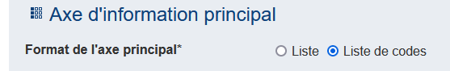

#  Création d'un tableau

La prochaine question se présente sous la forme d'un tableau dans lequel nous allons capter la ventilation des activités de la personne que l'on interroge.

Créons la question avec :

- le libellé "Quel pourcentage de votre temps de travail consacrez-vous en moyenne à ces différentes activités ?",
- et l'identifiant "ACTIVITES".

Nous choisissons ensuite le type de question "Tableau".

Le choix suivant du format de l'axe principal va permettre de déterminer le type de tableau que l'on va construire :

- Liste → pour la création d'un tableau dynamique, c'est à dire d'un tableau dont le nombre de lignes min et max est déterminé par des entiers numériques,
- Liste de codes → pour la création d'un tableau disposant d'entêtes de lignes créés à partir d'une liste de code.

Ici, on choisit le format "Liste de codes".

On [charge la liste de code](../guide/liste-de-code.md) "qsmldkf.csv".